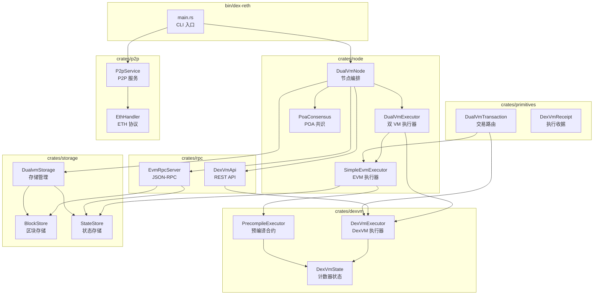

# DEX-RETH 架构总览

## 1. 系统架构图

```
┌─────────────────────────────────────────────────────────────────────────────┐
│                              DEX-RETH NODE                                  │
├─────────────────────────────────────────────────────────────────────────────┤
│                                                                             │
│  ┌─────────────────────────────────────────────────────────────────────┐   │
│  │                         CLI Entry Point                              │   │
│  │                      (bin/dex-reth/main.rs)                          │   │
│  └───────────────────────────────┬─────────────────────────────────────┘   │
│                                  │                                          │
│  ┌───────────────────────────────▼─────────────────────────────────────┐   │
│  │                          DualVmNode                                  │   │
│  │                      (crates/node/node.rs)                           │   │
│  │  ┌─────────────────────────────────────────────────────────────┐    │   │
│  │  │                    DualVmExecutor                            │    │   │
│  │  │  ┌──────────────────┐    ┌──────────────────┐               │    │   │
│  │  │  │ SimpleEvmExecutor │    │  DexVmExecutor   │               │    │   │
│  │  │  │   (EVM 交易执行)   │    │  (DexVM 交易执行) │               │    │   │
│  │  │  └────────┬─────────┘    └────────┬─────────┘               │    │   │
│  │  │           │                       │                          │    │   │
│  │  │           └───────────┬───────────┘                          │    │   │
│  │  │                       │                                      │    │   │
│  │  │              PrecompileExecutor                              │    │   │
│  │  │               (跨 VM 预编译调用)                               │    │   │
│  │  └─────────────────────────────────────────────────────────────┘    │   │
│  │                                                                      │   │
│  │  ┌─────────────────┐  ┌─────────────────┐  ┌─────────────────┐      │   │
│  │  │   PoaConsensus  │  │    P2pService   │  │   RPC Services  │      │   │
│  │  │   (区块共识)     │  │   (P2P 网络)    │  │  (EVM + DexVM)  │      │   │
│  │  └────────┬────────┘  └────────┬────────┘  └────────┬────────┘      │   │
│  └───────────┼────────────────────┼────────────────────┼───────────────┘   │
│              │                    │                    │                    │
│  ┌───────────▼────────────────────▼────────────────────▼───────────────┐   │
│  │                        DualvmStorage                                 │   │
│  │                    (crates/storage/storage.rs)                       │   │
│  │  ┌──────────────────────────┐  ┌──────────────────────────┐         │   │
│  │  │       BlockStore         │  │       StateStore          │         │   │
│  │  │  (区块头 + 交易索引)      │  │  (账户余额 + 计数器)       │         │   │
│  │  └──────────────────────────┘  └──────────────────────────┘         │   │
│  │                                                                      │   │
│  │  ┌──────────────────────────────────────────────────────────────┐   │   │
│  │  │                    MDBX Database                              │   │   │
│  │  │  ┌────────────┐ ┌────────────┐ ┌────────────┐ ┌────────────┐ │   │   │
│  │  │  │DualvmBlocks│ │DualvmAccounts│ │DualvmCounters│ │DualvmTxs│ │   │   │
│  │  │  └────────────┘ └────────────┘ └────────────┘ └────────────┘ │   │   │
│  │  └──────────────────────────────────────────────────────────────┘   │   │
│  └─────────────────────────────────────────────────────────────────────┘   │
│                                                                             │
└─────────────────────────────────────────────────────────────────────────────┘
```

## 2. 模块依赖关系



## 3. 端口服务

| 端口 | 服务 | 协议 | 说明 |
|------|------|------|------|
| 8545 | EVM RPC | JSON-RPC | 以太坊标准 RPC 接口 |
| 9845 | DexVM API | REST | 计数器操作 API |
| 30303 | P2P | devp2p | 节点间通信 |

## 4. 核心概念

### 双虚拟机 (Dual VM)
- **EVM**: 标准以太坊虚拟机，执行智能合约
- **DexVM**: 自定义虚拟机，管理计数器状态

### 交易路由
- 目标地址 `0xddddddddddddddddddddddddddddddddddddddd1` → DexVM
- 预编译地址 `0x0000000000000000000000000000000000000100` → 跨 VM 调用
- 其他地址 → EVM

### 状态根计算
```
combined_state_root = keccak256(evm_state_root || dexvm_state_root)
```

### POA 共识
- 单验证者出块
- 可配置出块间隔（默认 500ms）
- 区块签名验证
