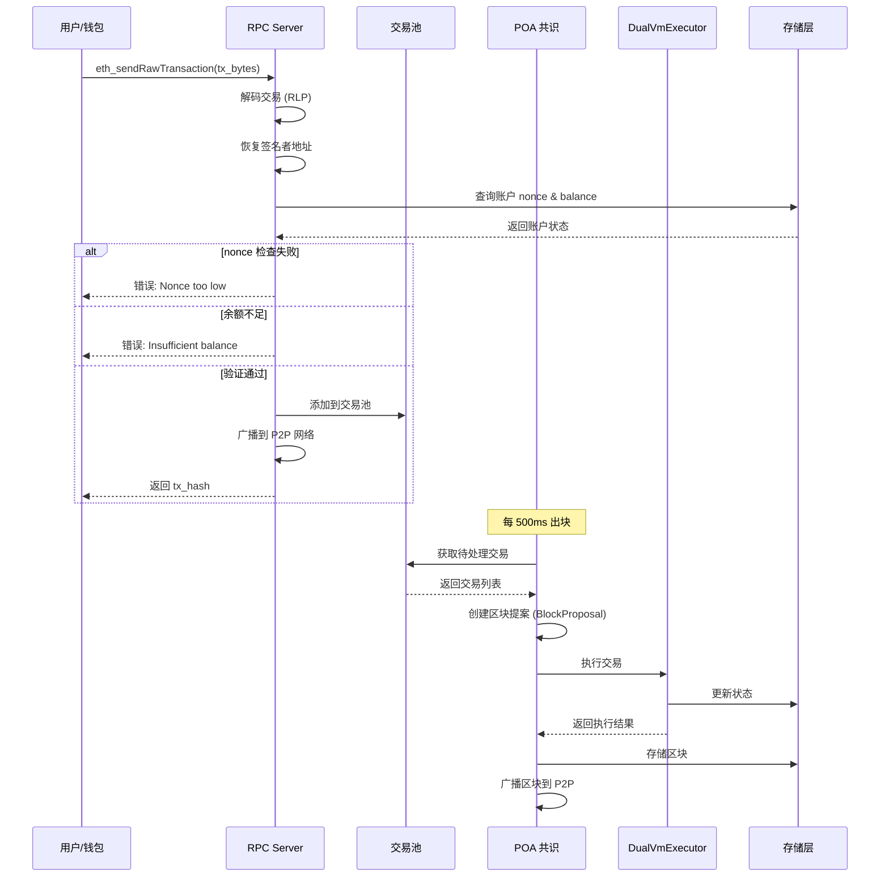
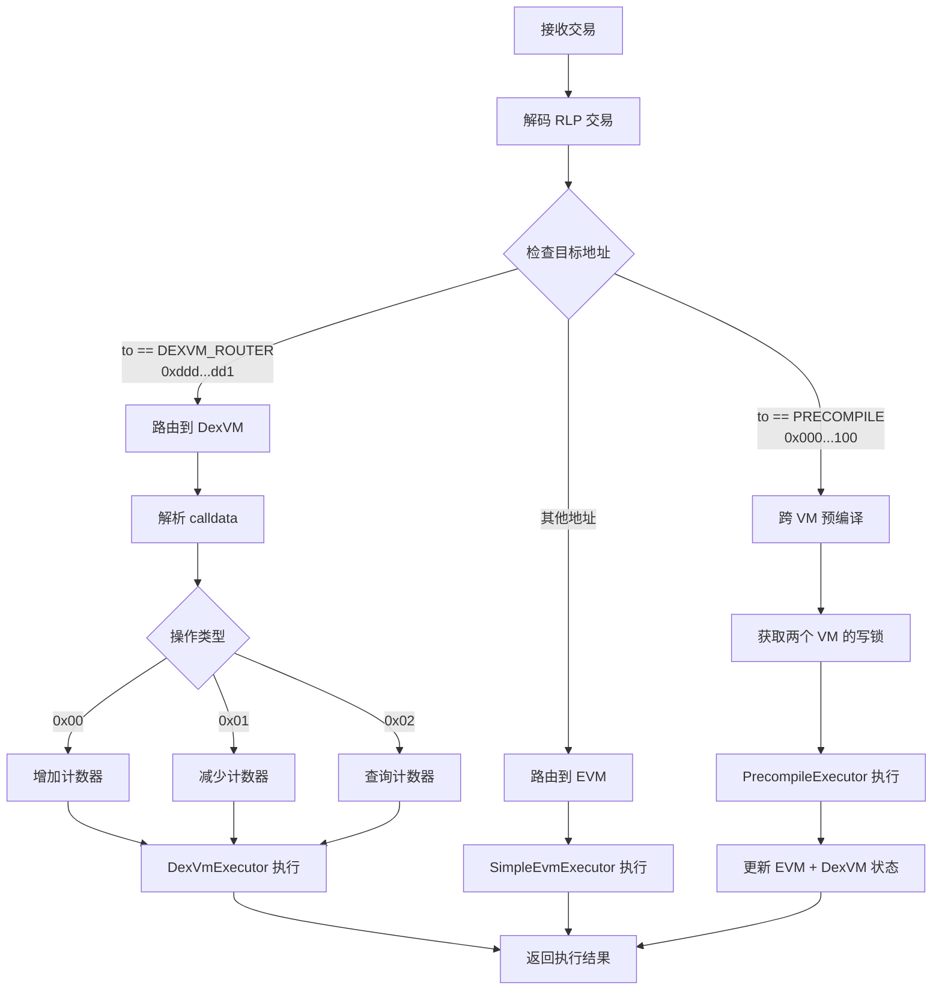
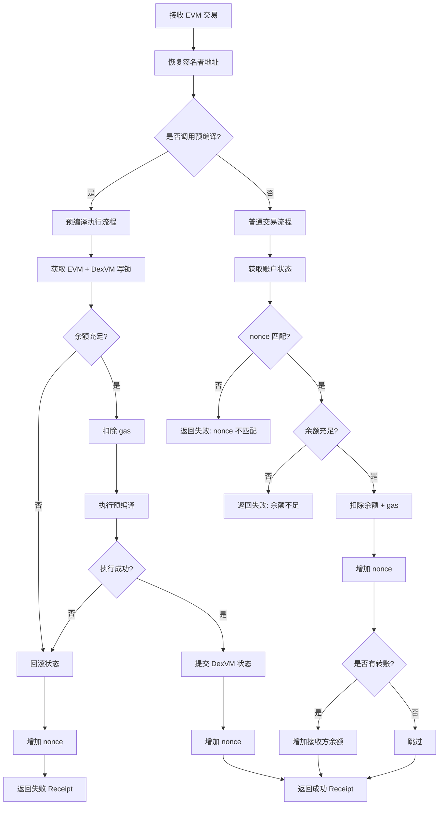
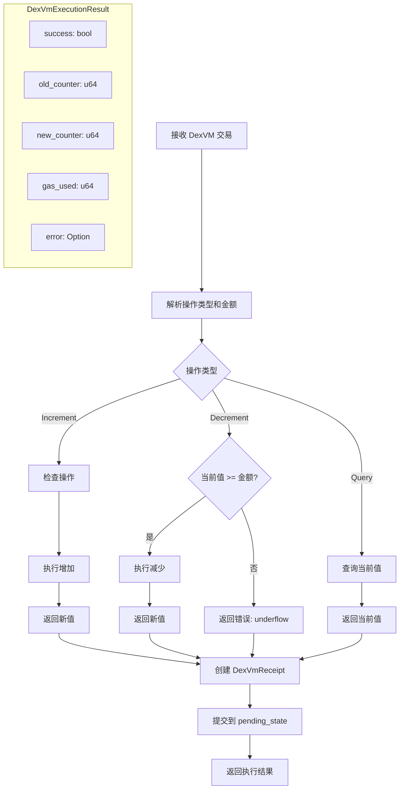

# 交易处理流程

## 1. 交易提交流程



## 2. 交易路由决策



## 3. DexVM 交易 Calldata 格式

```
┌─────────────┬─────────────────────────────────────┐
│  Byte 0     │  Bytes 1-8                          │
│  操作类型    │  金额 (u64 big-endian)               │
├─────────────┼─────────────────────────────────────┤
│  0x00       │  increment amount                   │
│  0x01       │  decrement amount                   │
│  0x02       │  padding (query 不需要金额)          │
└─────────────┴─────────────────────────────────────┘

示例:
增加 100: 0x00 0000000000000064
减少 50:  0x01 0000000000000032
查询:     0x02 0000000000000000
```

## 4. EVM 交易执行流程



## 5. DexVM 交易执行流程



## 6. Gas 消耗

| 操作 | Base Gas | 操作 Gas | 总 Gas |
|------|----------|----------|--------|
| EVM 转账 | 21,000 | - | 21,000 |
| DexVM Increment | 21,000 | 5,000 | 26,000 |
| DexVM Decrement | 21,000 | 5,000 | 26,000 |
| DexVM Query | 21,000 | 3,000 | 24,000 |
| 预编译调用 | 21,000 | 5,000 | 26,000 |

## 7. 交易收据格式

### EVM Receipt (alloy_consensus::Receipt)
```rust
Receipt {
    status: Eip658Value,        // true = 成功, false = 失败
    cumulative_gas_used: u64,   // 累计 gas 消耗
    logs: Vec<Log>,             // 事件日志
}
```

### DexVM Receipt
```rust
DexVmReceipt {
    from: Address,              // 发送者
    success: bool,              // 是否成功
    old_counter: u64,           // 操作前计数器值
    new_counter: u64,           // 操作后计数器值
    gas_used: u64,              // gas 消耗
    error: Option<String>,      // 错误信息
}
```
