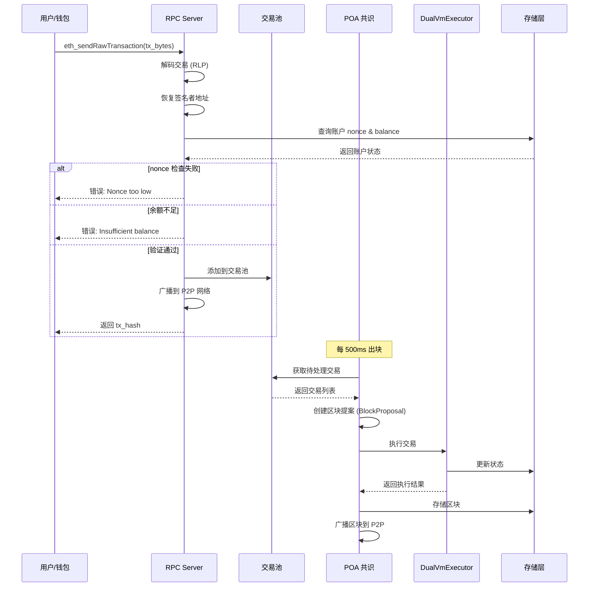
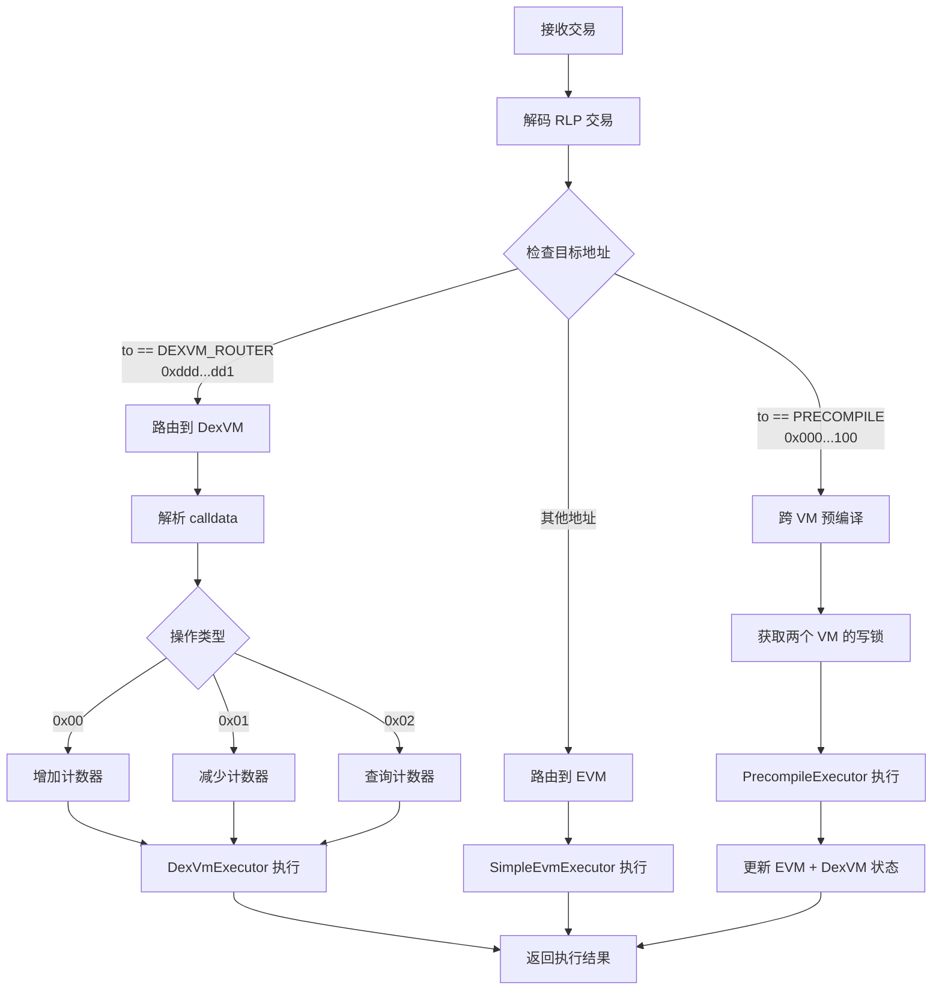
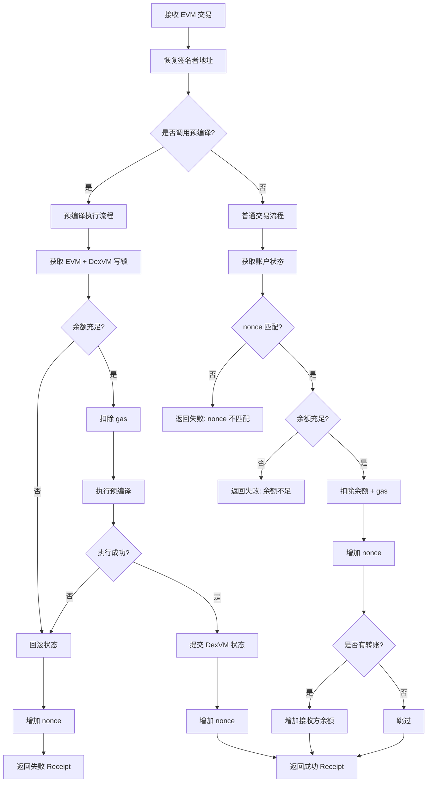
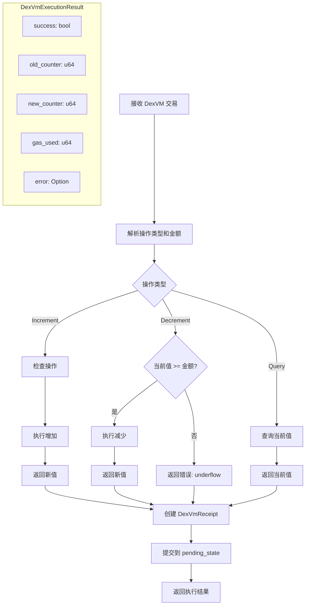

# 交易处理流程

## 1. 交易提交流程



## 2. 交易路由决策



## 3. DexVM 交易 Calldata 格式

```
┌─────────────┬─────────────────────────────────────┐
│  Byte 0     │  Bytes 1-8                          │
│  操作类型    │  金额 (u64 big-endian)               │
├─────────────┼─────────────────────────────────────┤
│  0x00       │  increment amount                   │
│  0x01       │  decrement amount                   │
│  0x02       │  padding (query 不需要金额)          │
└─────────────┴─────────────────────────────────────┘

示例:
增加 100: 0x00 0000000000000064
减少 50:  0x01 0000000000000032
查询:     0x02 0000000000000000
```

## 4. EVM 交易执行流程



## 5. DexVM 交易执行流程



## 6. Gas 消耗

| 操作 | Base Gas | 操作 Gas | 总 Gas |
|------|----------|----------|--------|
| EVM 转账 | 21,000 | - | 21,000 |
| DexVM Increment | 21,000 | 5,000 | 26,000 |
| DexVM Decrement | 21,000 | 5,000 | 26,000 |
| DexVM Query | 21,000 | 3,000 | 24,000 |
| 预编译调用 | 21,000 | 5,000 | 26,000 |

## 7. 交易收据格式

### EVM Receipt (alloy_consensus::Receipt)
```rust
Receipt {
    status: Eip658Value,        // true = 成功, false = 失败
    cumulative_gas_used: u64,   // 累计 gas 消耗
    logs: Vec<Log>,             // 事件日志
}
```

### DexVM Receipt
```rust
DexVmReceipt {
    from: Address,              // 发送者
    success: bool,              // 是否成功
    old_counter: u64,           // 操作前计数器值
    new_counter: u64,           // 操作后计数器值
    gas_used: u64,              // gas 消耗
    error: Option<String>,      // 错误信息
}
```

## 8. 地址角色详解

### 关键地址说明

| 地址 | 角色 | 说明 |
|------|------|------|
| `0xddd...dd1` | **to** (目标地址) | 固定的路由地址，告诉节点"这是 DexVM 交易" |
| 用户自己的地址 | **from** (发送者) | 从交易签名中恢复，作为计数器的 key |

**重要**: `0xddddddddddddddddddddddddddddddddddddddd1` 只是一个"门牌号"，用于告诉系统走 DexVM 通道。用户**不需要**持有这个地址的私钥。

### 交易签名与地址恢复

```
Alice (地址 0xAAAA) 想操作自己的计数器：

1. 构造交易
   to:   0xddddddddddddddddddddddddddddddddddddddd1  ← 固定路由地址
   data: 0x00 0000000000000064  (increment 100)

2. 用 Alice 的私钥签名

3. 发送到节点

4. 节点处理：
   - 从签名恢复出 from = 0xAAAA (Alice)
   - 看到 to = 0xddd...dd1，路由到 DexVM
   - 操作 counters[0xAAAA] += 100  ← Alice 的计数器
```

### 计数器存储结构

```
counters = {
    0xAAAA...: 100,   // Alice 的计数器
    0xBBBB...: 50,    // Bob 的计数器
    0xCCCC...: 200,   // Carol 的计数器
}
```

每个用户有自己独立的计数器，**key 是用户自己的地址 (from)**，不是路由地址。

## 9. REST API vs 以太坊交易

系统提供两种方式操作 DexVM 计数器，它们有本质区别：

### 对比表

| 特性 | REST API (Port 9845) | 以太坊交易 (to=0xddd...dd1) |
|------|---------------------|---------------------------|
| 打包进区块 | ❌ 不会 | ✅ 会 |
| P2P 网络同步 | ❌ 不会 | ✅ 会 |
| 交易签名验证 | ❌ 无 | ✅ 有 |
| 其他节点可验证 | ❌ 不能 | ✅ 能 |
| 钱包兼容 | ❌ 需要定制 | ✅ MetaMask 等可用 |
| from 地址来源 | URL 参数 (可伪造) | 签名恢复 (不可伪造) |

### REST API 的问题

```bash
# REST API: 任何人都可以冒充任何地址
curl -X POST http://localhost:9845/api/v1/counter/0xAAAA.../increment \
  -d '{"amount": 100}'
# from = URL 中的 0xAAAA，无需证明身份
```

```rust
// 服务器代码
let tx = DexVmTransaction {
    from: address,  // 直接从 URL 取，谁都可以填
    signature: [],  // 空的，没有验证
};
```

### 以太坊交易的安全性

```bash
# 以太坊交易: 必须用私钥签名
cast send 0xddddddddddddddddddddddddddddddddddddddd1 \
  --private-key 0xAlice私钥 \
  0x000000000000000064
# from = 从签名恢复，只有私钥持有者才能操作
```

### 状态同步差异

```
REST API (本地操作，不同步):
  节点A修改计数器 → 只有节点A知道 → 节点B查询时值不同 → 状态不一致

以太坊交易 (上链，全网同步):
  节点A发送TX → 打包进区块 → P2P广播 → 节点B收到区块并执行 → 状态一致
```

### 使用场景建议

| 场景 | 推荐方式 |
|------|---------|
| 本地调试/测试 | REST API |
| 生产环境状态变更 | 以太坊交易 |
| 需要全网共识 | 以太坊交易 |
| 查询计数器值 | REST API (只读，无副作用) |
