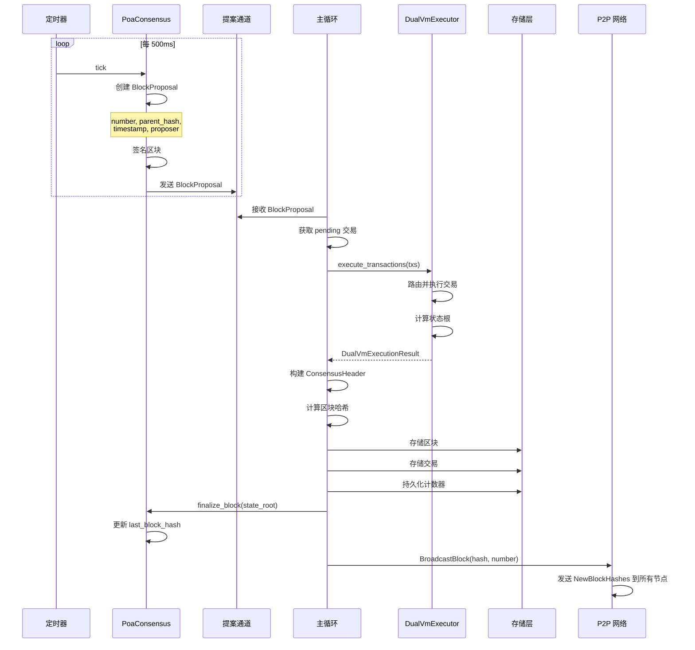
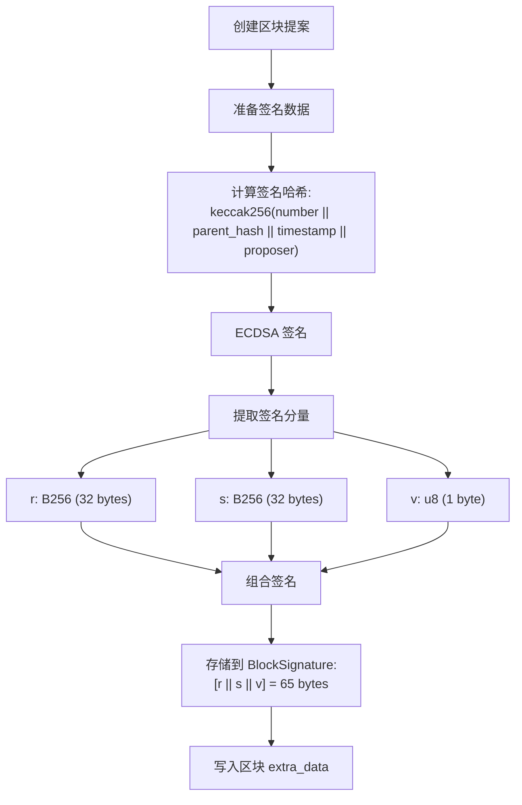
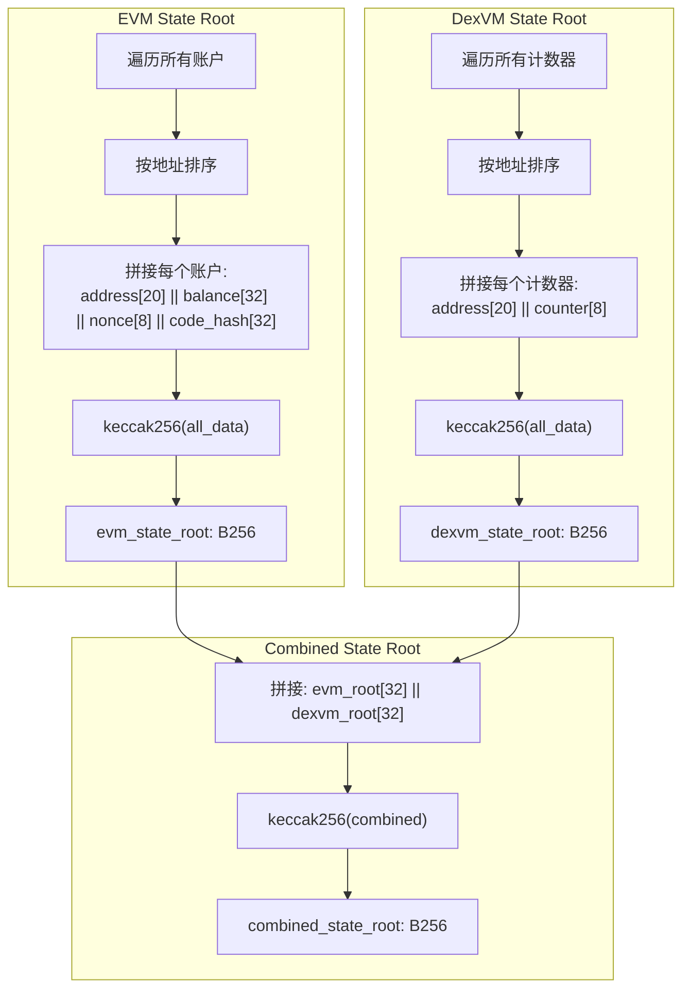

# 区块生产与共识流程

## 1. POA 共识架构

```
┌─────────────────────────────────────────────────────────────────┐
│                        POA Consensus Engine                     │
├─────────────────────────────────────────────────────────────────┤
│                                                                 │
│  ┌─────────────────────────────────────────────────────────┐   │
│  │                    PoaConfig                             │   │
│  │  ┌──────────────┬──────────────┬──────────────────┐     │   │
│  │  │ secret_key   │ validator    │ block_interval   │     │   │
│  │  │ (签名私钥)   │ (验证者地址)  │ (出块间隔)       │     │   │
│  │  └──────────────┴──────────────┴──────────────────┘     │   │
│  └─────────────────────────────────────────────────────────┘   │
│                                                                 │
│  ┌─────────────────────────────────────────────────────────┐   │
│  │                    PoaConsensus                          │   │
│  │  ┌──────────────────────────────────────────────────┐   │   │
│  │  │  proposal_tx: Sender<BlockProposal>              │   │   │
│  │  │  proposal_rx: Receiver<BlockProposal>            │   │   │
│  │  │  next_block_number: u64                          │   │   │
│  │  │  last_block_hash: B256                           │   │   │
│  │  │  last_state_root: B256                           │   │   │
│  │  └──────────────────────────────────────────────────┘   │   │
│  └─────────────────────────────────────────────────────────┘   │
│                                                                 │
└─────────────────────────────────────────────────────────────────┘
```

## 2. 区块生产流程



## 3. 区块签名流程



## 4. 区块哈希计算

```mermaid
flowchart TD
    START[执行完成] --> BUILD_HEADER[构建 ConsensusHeader]

    BUILD_HEADER --> FIELDS["填充字段:<br/>parent_hash<br/>ommers_hash = keccak256([0x80])<br/>beneficiary<br/>state_root<br/>transactions_root<br/>receipts_root<br/>logs_bloom = Bloom::ZERO<br/>difficulty = 0<br/>number<br/>gas_limit<br/>gas_used<br/>timestamp<br/>extra_data = signature<br/>mix_hash = B256::ZERO<br/>nonce = B64::ZERO<br/>base_fee_per_gas = Some(0)"]

    FIELDS --> RLP_ENCODE[RLP 编码 Header]
    RLP_ENCODE --> KECCAK[keccak256(rlp_bytes)]
    KECCAK --> BLOCK_HASH["block_hash: B256"]

    BLOCK_HASH --> STORE[存储到 StoredBlock]
```

## 5. 区块结构

```
StoredBlock
├── number: u64                    // 区块高度
├── hash: B256                     // 区块哈希 (RLP 编码后的 keccak256)
├── parent_hash: B256              // 父区块哈希
├── timestamp: u64                 // Unix 时间戳
├── gas_limit: u64                 // Gas 上限 (30,000,000)
├── gas_used: u64                  // 实际使用的 Gas
├── miner: Address                 // 验证者地址
├── evm_state_root: B256           // EVM 状态根
├── dexvm_state_root: B256         // DexVM 状态根
├── combined_state_root: B256      // 组合状态根
├── transaction_hashes: Vec<B256>  // 交易哈希列表
├── transaction_count: u64         // 交易数量
└── signature: [u8; 65]            // POA 签名 (r || s || v)
```

## 6. 区块提案结构

```
BlockProposal
├── number: u64                    // 区块高度
├── parent_hash: B256              // 父区块哈希
├── timestamp: u64                 // 时间戳
├── transactions: Vec<TransactionSigned>  // 交易列表 (初始为空)
├── proposer: Address              // 提案者地址
└── signature: BlockSignature      // 区块签名
    ├── r: B256                    // 签名 r 分量
    ├── s: B256                    // 签名 s 分量
    └── v: u8                      // 恢复 ID
```

## 7. 状态根计算



## 8. 共识时序

```
Time ─────────────────────────────────────────────────────────►

     │ 500ms │ 500ms │ 500ms │ 500ms │ 500ms │
     ├───────┼───────┼───────┼───────┼───────┤
     │       │       │       │       │       │
     ▼       ▼       ▼       ▼       ▼       ▼
   Block   Block   Block   Block   Block   Block
     1       2       3       4       5       6

每个区块:
┌─────────────────────────────────────────────┐
│ 1. 创建 BlockProposal                       │
│ 2. 签名区块                                 │
│ 3. 从 mempool 获取交易                      │
│ 4. 执行交易                                 │
│ 5. 计算状态根                               │
│ 6. 存储区块                                 │
│ 7. 广播到 P2P 网络                          │
│ 8. 更新 last_block_hash                     │
└─────────────────────────────────────────────┘
```

## 9. 验证者配置

```rust
PoaConfig {
    secret_key: SecretKey,      // 验证者私钥
    validator: Address,         // 验证者地址 (从私钥派生)
    block_interval: Duration,   // 出块间隔 (默认 500ms)
    starting_block: u64,        // 起始区块号 (从数据库加载)
}

// 默认验证者 (Hardhat 第一个测试账户)
private_key: 0xac0974bec39a17e36ba4a6b4d238ff944bacb478cbed5efcae784d7bf4f2ff80
address: 0xf39Fd6e51aad88F6F4ce6aB8827279cffFb92266
```
