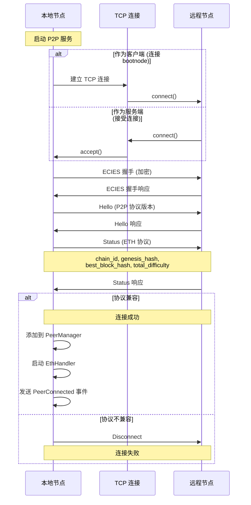
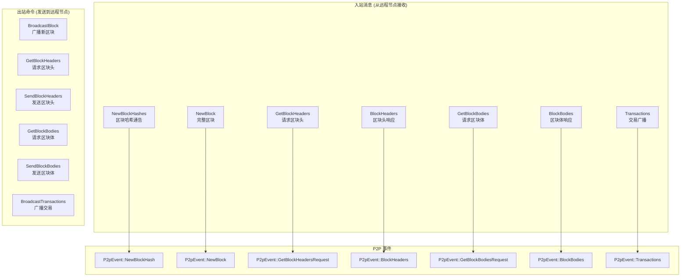
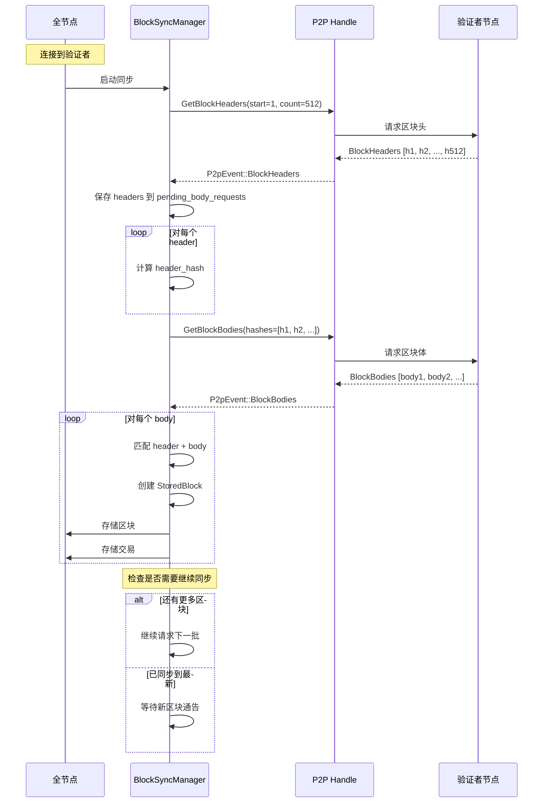
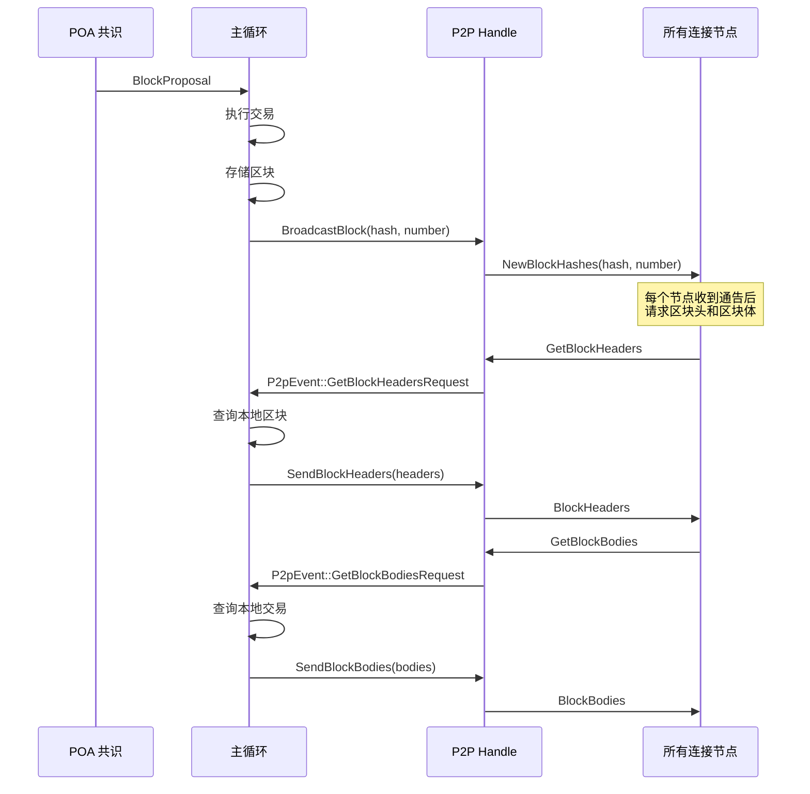
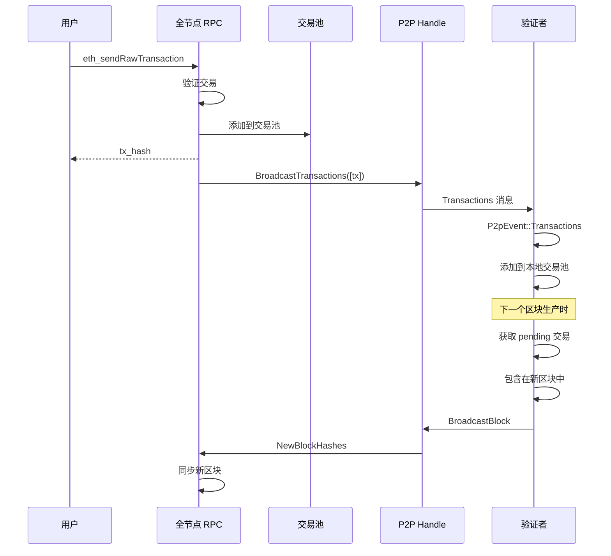

# P2P 网络流程

## 1. P2P 架构

```
┌─────────────────────────────────────────────────────────────────────────────┐
│                              P2P Service                                    │
├─────────────────────────────────────────────────────────────────────────────┤
│                                                                             │
│  ┌─────────────────────────────────────────────────────────────────────┐   │
│  │                         P2pConfig                                    │   │
│  │  ┌──────────────┬──────────────┬──────────────┬──────────────────┐  │   │
│  │  │ secret_key   │ chain_id     │ genesis_hash │ listen_port      │  │   │
│  │  │ (节点密钥)   │ (链 ID)      │ (创世哈希)   │ (监听端口)       │  │   │
│  │  └──────────────┴──────────────┴──────────────┴──────────────────┘  │   │
│  │  ┌──────────────┬──────────────┐                                    │   │
│  │  │ boot_nodes   │ max_peers    │                                    │   │
│  │  │ (引导节点)   │ (最大连接数) │                                    │   │
│  │  └──────────────┴──────────────┘                                    │   │
│  └─────────────────────────────────────────────────────────────────────┘   │
│                                                                             │
│  ┌─────────────────────────────────────────────────────────────────────┐   │
│  │                        P2pHandle                                     │   │
│  │  ├── local_id: PeerId           (本地节点 ID)                        │   │
│  │  ├── cmd_tx: Sender<SessionCommand>  (命令通道)                      │   │
│  │  ├── event_tx: broadcast::Sender<P2pEvent>  (事件广播)               │   │
│  │  └── peer_count: Arc<AtomicUsize>  (连接计数)                        │   │
│  └─────────────────────────────────────────────────────────────────────┘   │
│                                                                             │
│  ┌─────────────────────────────────────────────────────────────────────┐   │
│  │                       PeerManager                                    │   │
│  │  ├── connected_peers: HashMap<PeerId, PeerInfo>                      │   │
│  │  ├── pending_connections: HashSet<PeerId>                            │   │
│  │  └── max_peers: usize                                                │   │
│  └─────────────────────────────────────────────────────────────────────┘   │
│                                                                             │
│  ┌─────────────────────────────────────────────────────────────────────┐   │
│  │                      EthHandler (per peer)                           │   │
│  │  ├── peer_id: PeerId                                                 │   │
│  │  ├── stream: TcpStream (加密连接)                                    │   │
│  │  ├── capabilities: Vec<Capability>                                   │   │
│  │  └── request_id: u64 (请求计数器)                                    │   │
│  └─────────────────────────────────────────────────────────────────────┘   │
│                                                                             │
└─────────────────────────────────────────────────────────────────────────────┘
```

## 2. 节点连接流程



## 3. ETH 协议消息



## 4. 区块同步流程 (全节点)



## 5. 新区块广播流程 (验证者)



## 6. 交易转发流程



## 7. Enode URL 格式

```
enode://<public_key>@<ip>:<port>

示例:
enode://c6ecdf9e2d5c7838b2787f71e533e0f97ed4d6dde57286884e16683603c4266bb800c67b4bc40cf68c44e0d750b1238306e16af0e16edc80dd24430eaf3d1253@15.235.230.59:30303

组成部分:
├── public_key: 64 字节的 secp256k1 公钥 (十六进制)
├── ip: 节点 IP 地址
└── port: P2P 端口
```

## 8. P2P 密钥管理

```
密钥存储位置: <datadir>/p2p_key

密钥格式: 32 字节的 secp256k1 私钥 (十六进制)

示例:
dc5ef21e7897d317d57cf5336f8be8d75123a8f075196ccec3c8693030fc20c0

节点启动时:
1. 检查 p2p_key 文件是否存在
2. 如果存在: 加载私钥
3. 如果不存在: 生成新私钥并保存
4. 从私钥派生公钥 (PeerId)
5. 构建 enode URL
```

## 9. SessionCommand 命令类型

```rust
enum SessionCommand {
    // 广播新区块哈希给所有节点
    BroadcastBlock { hash: B256, number: u64 },

    // 请求区块头 (从指定节点)
    GetBlockHeaders { peer_id: PeerId, start: u64, count: u64 },

    // 发送区块头响应 (给指定节点)
    SendBlockHeaders { peer_id: PeerId, request_id: u64, headers: Vec<Header> },

    // 请求区块体 (从指定节点)
    GetBlockBodies { peer_id: PeerId, hashes: Vec<B256> },

    // 发送区块体响应 (给指定节点)
    SendBlockBodies { peer_id: PeerId, request_id: u64, bodies: Vec<BlockBody> },

    // 广播交易给所有节点
    BroadcastTransactions { transactions: Vec<Vec<u8>> },
}
```

## 10. P2pEvent 事件类型

```rust
enum P2pEvent {
    // 节点连接
    PeerConnected { peer_id: PeerId, addr: SocketAddr },

    // 节点断开
    PeerDisconnected { peer_id: PeerId },

    // 收到新区块哈希通告
    NewBlockHash { peer_id: PeerId, hash: B256, number: u64 },

    // 收到完整新区块
    NewBlock { peer_id: PeerId, hash: B256, number: u64 },

    // 收到区块头请求
    GetBlockHeadersRequest { peer_id: PeerId, request_id: u64, start: HashOrNumber, limit: u64 },

    // 收到区块头响应
    BlockHeaders { peer_id: PeerId, request_id: u64, headers: Vec<Header> },

    // 收到区块体请求
    GetBlockBodiesRequest { peer_id: PeerId, request_id: u64, hashes: Vec<B256> },

    // 收到区块体响应
    BlockBodies { peer_id: PeerId, request_id: u64, bodies: Vec<BlockBody> },

    // 收到交易广播
    Transactions { peer_id: PeerId, transactions: Vec<Vec<u8>> },
}
```
