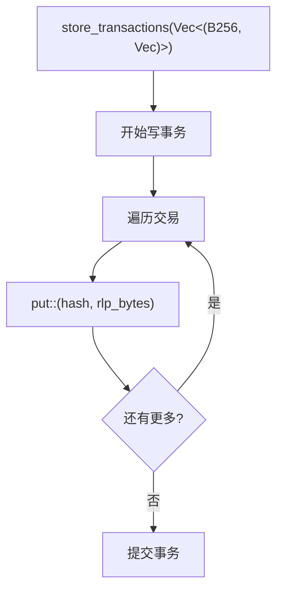
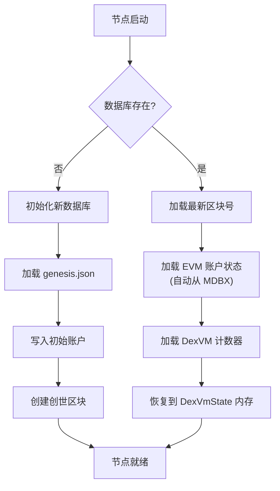

# 存储层架构

## 1. 存储层总览

```
┌─────────────────────────────────────────────────────────────────────────────┐
│                            DualvmStorage                                    │
│                        (crates/storage/storage.rs)                          │
├─────────────────────────────────────────────────────────────────────────────┤
│                                                                             │
│  ┌─────────────────────────────────────────────────────────────────────┐   │
│  │                        Arc<DatabaseEnv>                              │   │
│  │                          (MDBX 数据库)                               │   │
│  └───────────────────────────────┬─────────────────────────────────────┘   │
│                                  │                                          │
│          ┌───────────────────────┼───────────────────────┐                  │
│          │                       │                       │                  │
│          ▼                       ▼                       ▼                  │
│  ┌───────────────┐       ┌───────────────┐       ┌───────────────┐         │
│  │  BlockStore   │       │  StateStore   │       │  is_new flag  │         │
│  │  (区块存储)    │       │  (状态存储)   │       │  (新数据库?)   │         │
│  └───────┬───────┘       └───────┬───────┘       └───────────────┘         │
│          │                       │                                          │
│          ▼                       ▼                                          │
│  ┌─────────────────┐     ┌─────────────────────────────────────────────┐   │
│  │ DualvmBlocks    │     │  DualvmAccounts  │  DualvmCounters          │   │
│  │ DualvmTxHashes  │     │  DualvmStorage   │                          │   │
│  │ DualvmTransactions│   └─────────────────────────────────────────────┘   │
│  └─────────────────┘                                                        │
│                                                                             │
└─────────────────────────────────────────────────────────────────────────────┘
```

## 2. 数据库初始化流程

```mermaid
flowchart TD
    START[DualvmStorage::new(path)] --> CHECK{mdbx.dat 存在?}

    CHECK -->|否| NEW_DB[标记为新数据库]
    CHECK -->|是| EXISTING[标记为已有数据库]

    NEW_DB --> CREATE_DIR[创建数据目录]
    EXISTING --> CREATE_DIR

    CREATE_DIR --> INIT_DB["init_db_for::<DualvmTableSet>(path)"]
    INIT_DB --> CREATE_STORES[创建 BlockStore + StateStore]

    CREATE_STORES --> RETURN["返回 DualvmStorage"]

    subgraph "节点启动时"
        NODE_START[DualVmNode 启动] --> CHECK_NEW{是新数据库?}

        CHECK_NEW -->|是| INIT_GENESIS["初始化 Genesis:<br/>1. 写入账户余额<br/>2. 创建创世区块"]
        CHECK_NEW -->|否| LOAD_STATE["加载已有状态:<br/>1. 读取最新区块号<br/>2. 加载 DexVM 计数器"]

        INIT_GENESIS --> READY[节点就绪]
        LOAD_STATE --> READY
    end
```

## 3. BlockStore 操作

### 区块存储

```mermaid
flowchart TD
    STORE[store_block(StoredBlock)] --> START_TX[开始 MDBX 写事务]

    START_TX --> PUT_BLOCK["put::<DualvmBlocks>(number, block)"]
    PUT_BLOCK --> UPDATE_LATEST[更新 latest_block_number]
    UPDATE_LATEST --> COMMIT[提交事务]

    COMMIT --> SUCCESS[返回成功]
```

### 区块查询

```mermaid
flowchart TD
    subgraph "按区块号查询"
        BY_NUM[get_block_by_number(num)] --> READ_TX1[开始读事务]
        READ_TX1 --> GET1["get::<DualvmBlocks>(num)"]
        GET1 --> DECODE1[解码 StoredBlock]
        DECODE1 --> RETURN1[返回 Option<StoredBlock>]
    end

    subgraph "按哈希查询"
        BY_HASH[get_block_by_hash(hash)] --> SCAN[遍历所有区块]
        SCAN --> MATCH{hash 匹配?}
        MATCH -->|是| RETURN2[返回区块]
        MATCH -->|否| CONTINUE[继续遍历]
        CONTINUE --> SCAN
    end
```

### 交易存储



## 4. StateStore 操作

### 余额操作

```rust
// 获取余额
pub fn get_balance(&self, address: &Address) -> U256 {
    let tx = self.db.tx().ok()?;
    tx.get::<DualvmAccounts>(*address)?
        .map(|a| a.balance)
        .unwrap_or(U256::ZERO)
}

// 设置余额
pub fn set_balance(&self, address: Address, balance: U256) -> Result<()> {
    let tx = self.db.tx_mut()?;

    let mut account = tx.get::<DualvmAccounts>(address)?
        .unwrap_or_default();

    account.balance = balance;
    tx.put::<DualvmAccounts>(address, account)?;
    tx.commit()?;
    Ok(())
}
```

### Nonce 操作

```rust
// 获取 nonce
pub fn get_nonce(&self, address: &Address) -> u64 {
    // 类似 get_balance
}

// 增加 nonce
pub fn increment_nonce(&self, address: Address) -> Result<u64> {
    let tx = self.db.tx_mut()?;
    let mut account = tx.get::<DualvmAccounts>(address)?
        .unwrap_or_default();

    account.nonce += 1;
    let new_nonce = account.nonce;

    tx.put::<DualvmAccounts>(address, account)?;
    tx.commit()?;
    Ok(new_nonce)
}
```

### 计数器操作

```rust
// 获取计数器
pub fn get_counter(&self, address: &Address) -> u64 {
    let tx = self.db.tx().ok()?;
    tx.get::<DualvmCounters>(*address)?
        .map(|c| c.value)
        .unwrap_or(0)
}

// 设置计数器
pub fn set_counter(&self, address: Address, value: u64) -> Result<()> {
    let tx = self.db.tx_mut()?;
    tx.put::<DualvmCounters>(address, StoredCounter { value })?;
    tx.commit()?;
    Ok(())
}

// 增加计数器
pub fn increment_counter(&self, address: Address, amount: u64) -> Result<u64> {
    let tx = self.db.tx_mut()?;
    let current = tx.get::<DualvmCounters>(address)?
        .map(|c| c.value)
        .unwrap_or(0);

    let new_value = current.saturating_add(amount);
    tx.put::<DualvmCounters>(address, StoredCounter { value: new_value })?;
    tx.commit()?;
    Ok(new_value)
}
```

## 5. 状态根计算

```mermaid
flowchart TD
    subgraph "EVM State Root"
        E_START[state_root()] --> E_READ[开始读事务]
        E_READ --> E_CURSOR[创建账户游标]
        E_CURSOR --> E_WALK[遍历所有账户]

        E_WALK --> E_CONCAT["拼接数据:<br/>address[20]<br/>balance[32]<br/>nonce[8]<br/>code_hash[32]"]

        E_CONCAT --> E_NEXT{还有更多账户?}
        E_NEXT -->|是| E_WALK
        E_NEXT -->|否| E_HASH["keccak256(all_data)"]

        E_HASH --> E_RETURN[返回 B256]
    end

    subgraph "DexVM State Root"
        D_START[state_root()] --> D_SORT[按地址排序计数器]
        D_SORT --> D_WALK[遍历所有计数器]

        D_WALK --> D_CONCAT["拼接数据:<br/>address[20]<br/>counter[8]"]

        D_CONCAT --> D_NEXT{还有更多?}
        D_NEXT -->|是| D_WALK
        D_NEXT -->|否| D_HASH["keccak256(all_data)"]

        D_HASH --> D_RETURN[返回 B256]
    end
```

## 6. 数据持久化时机

```
区块生产周期内的持久化点:

┌─────────────────────────────────────────────────────────────────────────┐
│                          Block Production                               │
├─────────────────────────────────────────────────────────────────────────┤
│                                                                         │
│  1. 收到交易 (eth_sendRawTransaction)                                   │
│     └── 不持久化，只加入内存交易池                                       │
│                                                                         │
│  2. 执行交易 (execute_transactions)                                     │
│     ├── EVM 交易: set_balance(), increment_nonce()                     │
│     │   └── 每次操作都 commit() 到 MDBX                                 │
│     │                                                                   │
│     └── DexVM 交易: 只更新内存中的 pending_state                        │
│         └── 不持久化                                                    │
│                                                                         │
│  3. 存储区块 (store_block)                                              │
│     ├── BlockStore: 存储区块头                                          │
│     ├── BlockStore: 存储交易哈希索引                                    │
│     └── BlockStore: 存储完整交易数据                                    │
│                                                                         │
│  4. 持久化计数器                                                         │
│     └── StateStore::set_counter() for each counter                     │
│         └── commit() 到 MDBX                                            │
│                                                                         │
│  5. Finalize block                                                      │
│     └── 更新共识引擎状态 (内存)                                          │
│                                                                         │
└─────────────────────────────────────────────────────────────────────────┘
```

## 7. MDBX 特性

```
MDBX (Memory-mapped Database)
├── 特性:
│   ├── ACID 事务
│   ├── 零拷贝读取
│   ├── 支持大数据集
│   ├── 崩溃恢复
│   └── 高并发读取
│
├── 文件结构:
│   ├── <datadir>/mdbx.dat     (主数据文件)
│   └── <datadir>/mdbx.lck     (锁文件)
│
├── 事务类型:
│   ├── tx() → 只读事务 (可并发)
│   └── tx_mut() → 读写事务 (独占)
│
└── 数据编码:
    ├── Key: 实现 Encode trait
    ├── Value: 实现 Compress trait
    └── 使用 Compact 宏自动派生
```

## 8. Genesis 初始化

```rust
pub fn init_genesis(&self, alloc: HashMap<Address, U256>) -> Result<()> {
    let tx = self.db.tx_mut()?;

    for (address, balance) in alloc {
        let account = StoredDualvmAccount {
            balance,
            nonce: 0,
            code_hash: B256::ZERO,
            is_contract: false,
        };
        tx.put::<DualvmAccounts>(address, account)?;
    }

    tx.commit()?;
    Ok(())
}
```

Genesis 区块结构:
```json
{
  "config": {
    "chainId": 13337
  },
  "alloc": {
    "0xf39Fd6e51aad88F6F4ce6aB8827279cffFb92266": {
      "balance": "10000000000000000000000"
    }
  }
}
```

## 9. 数据恢复流程


