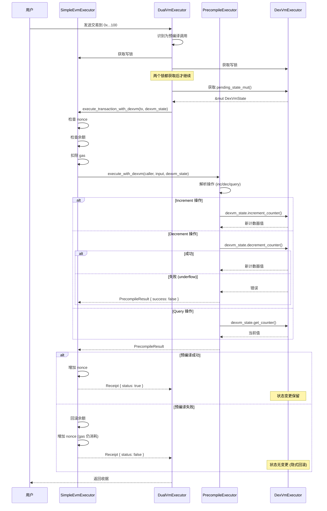
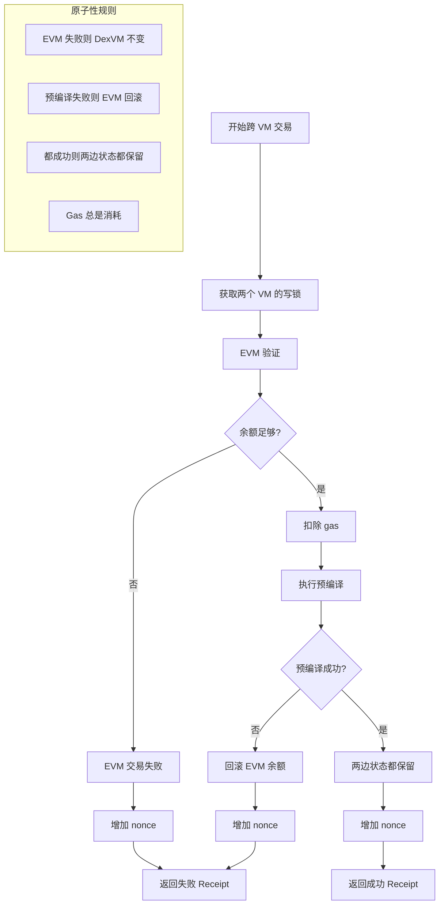

# 跨 VM 执行与预编译

## 1. 跨 VM 调用架构

```
┌─────────────────────────────────────────────────────────────────────────────┐
│                           Cross-VM Execution                                │
├─────────────────────────────────────────────────────────────────────────────┤
│                                                                             │
│  ┌─────────────────────────────────────────────────────────────────────┐   │
│  │                    DualVmExecutor                                    │   │
│  │  ┌──────────────────────────────────────────────────────────────┐   │   │
│  │  │              execute_cross_vm_transaction()                   │   │   │
│  │  │                                                               │   │   │
│  │  │  ┌────────────────────┐     ┌────────────────────┐           │   │   │
│  │  │  │ SimpleEvmExecutor  │◄───►│  DexVmExecutor     │           │   │   │
│  │  │  │  (write lock)      │     │  (write lock)      │           │   │   │
│  │  │  └─────────┬──────────┘     └──────────┬─────────┘           │   │   │
│  │  │            │                           │                      │   │   │
│  │  │            │    ┌─────────────────┐    │                      │   │   │
│  │  │            └───►│PrecompileExecutor│◄──┘                      │   │   │
│  │  │                 │ (访问两个 VM)    │                          │   │   │
│  │  │                 └─────────────────┘                           │   │   │
│  │  └──────────────────────────────────────────────────────────────┘   │   │
│  └─────────────────────────────────────────────────────────────────────┘   │
│                                                                             │
│  关键点:                                                                    │
│  • 两个执行器都需要写锁 (原子操作)                                          │
│  • EVM 执行失败时，DexVM 状态不变 (隐式回滚)                                │
│  • 预编译合约作为桥梁连接两个 VM                                            │
│                                                                             │
└─────────────────────────────────────────────────────────────────────────────┘
```

## 2. 预编译合约地址

```
计数器预编译地址: 0x0000000000000000000000000000000000000100

地址范围:
• 0x0000...0001 - 0x0000...0009: 以太坊标准预编译
• 0x0000...0100: 计数器预编译 (DexVM 桥)
• 0xdddd...ddd1: DexVM 路由地址 (纯 DexVM 交易)
```

## 3. 跨 VM 执行流程



## 4. 预编译执行器实现

```rust
/// 预编译执行器
pub struct PrecompileExecutor {
    // 无状态
}

impl PrecompileExecutor {
    /// 执行预编译调用 (带 DexVM 状态访问)
    pub fn execute_with_dexvm(
        &self,
        caller: Address,
        _to: Address,
        input: &Bytes,
        dexvm_state: Option<&mut DexVmState>,
    ) -> Result<PrecompileResult, BlockExecutionError> {

        // 解析 calldata
        if input.len() < 9 {
            return Err(BlockExecutionError::msg("Invalid input length"));
        }

        let op_type = input[0];
        let amount = u64::from_be_bytes(input[1..9].try_into().unwrap());

        // 获取 DexVM 状态
        let state = dexvm_state.ok_or_else(|| {
            BlockExecutionError::msg("DexVM state required")
        })?;

        // 执行操作
        match op_type {
            OP_INCREMENT => {
                let new_value = state.increment_counter(&caller, amount);
                Ok(PrecompileResult {
                    success: true,
                    gas_used: BASE_TX_GAS + COUNTER_OP_GAS,
                    output: new_value.to_be_bytes().to_vec().into(),
                    error: None,
                })
            }
            OP_DECREMENT => {
                match state.decrement_counter(&caller, amount) {
                    Ok(new_value) => Ok(PrecompileResult {
                        success: true,
                        gas_used: BASE_TX_GAS + COUNTER_OP_GAS,
                        output: new_value.to_be_bytes().to_vec().into(),
                        error: None,
                    }),
                    Err(e) => Ok(PrecompileResult {
                        success: false,
                        gas_used: BASE_TX_GAS + COUNTER_OP_GAS,
                        output: Bytes::new(),
                        error: Some(e.to_string()),
                    }),
                }
            }
            OP_QUERY => {
                let value = state.get_counter(&caller);
                Ok(PrecompileResult {
                    success: true,
                    gas_used: BASE_TX_GAS + QUERY_OP_GAS,
                    output: value.to_be_bytes().to_vec().into(),
                    error: None,
                })
            }
            _ => Err(BlockExecutionError::msg("Unknown operation")),
        }
    }
}
```

## 5. Calldata 格式

```
预编译调用 Calldata 格式 (9 bytes):

┌─────────────────────────────────────────────────────────────┐
│  Byte 0   │  Bytes 1-8                                      │
│  op_type  │  amount (u64 big-endian)                        │
├───────────┼─────────────────────────────────────────────────┤
│   0x00    │  increment amount                               │
│   0x01    │  decrement amount                               │
│   0x02    │  (ignored - query)                              │
└───────────┴─────────────────────────────────────────────────┘

示例:
• 增加 100: 0x00 0000000000000064
• 减少 50:  0x01 0000000000000032
• 查询:     0x02 0000000000000000
```

## 6. 原子性保证



## 7. 状态一致性

```
EVM 状态                          DexVM 状态
┌─────────────┐                   ┌─────────────┐
│  Account A  │                   │  Counter A  │
│  balance: X │                   │  value: Y   │
└──────┬──────┘                   └──────┬──────┘
       │                                 │
       │    ┌───────────────────────┐    │
       └───►│  Precompile 调用      │◄───┘
            │  (原子执行)           │
            └───────────┬───────────┘
                        │
         ┌──────────────┴──────────────┐
         │                             │
         ▼                             ▼
┌─────────────┐                 ┌─────────────┐
│ 成功:       │                 │ 失败:       │
│ balance: X-gas│               │ balance: X  │
│ nonce: +1   │                 │ nonce: +1   │
│ Counter: Y+amount│            │ Counter: Y  │
└─────────────┘                 └─────────────┘
```

## 8. 与纯 DexVM 交易对比

```
纯 DexVM 交易 (to = 0xddd...dd1)        跨 VM 预编译 (to = 0x...100)
┌─────────────────────────────┐         ┌─────────────────────────────┐
│ 1. 不需要 EVM 参与          │         │ 1. EVM 验证 (nonce, balance)│
│ 2. 直接执行 DexVM 操作      │         │ 2. 扣除 gas                 │
│ 3. 无 EVM 状态变更          │         │ 3. 调用预编译               │
│ 4. Gas 独立计算             │         │ 4. 修改 DexVM 状态          │
│                             │         │ 5. 更新 EVM nonce           │
│                             │         │ 6. 失败时回滚 EVM           │
└─────────────────────────────┘         └─────────────────────────────┘

使用场景:
• 纯 DexVM: 简单计数器操作，不需要 EVM 状态
• 预编译: 需要 EVM 账户验证，或者智能合约调用
```

## 9. 预编译调用示例 (使用 cast)

```bash
# 增加计数器 100
# calldata: 0x00 (increment) + 0000000000000064 (100)
cast send 0x0000000000000000000000000000000000000100 \
    "0x000000000000000064" \
    --private-key $PRIVATE_KEY \
    --rpc-url http://localhost:8545

# 减少计数器 50
# calldata: 0x01 (decrement) + 0000000000000032 (50)
cast send 0x0000000000000000000000000000000000000100 \
    "0x010000000000000032" \
    --private-key $PRIVATE_KEY \
    --rpc-url http://localhost:8545

# 查询计数器
# calldata: 0x02 (query) + 0000000000000000
cast send 0x0000000000000000000000000000000000000100 \
    "0x020000000000000000" \
    --private-key $PRIVATE_KEY \
    --rpc-url http://localhost:8545
```

## 10. 智能合约调用预编译

```solidity
// Solidity 示例
contract CounterUser {
    address constant COUNTER_PRECOMPILE = 0x0000000000000000000000000000000000000100;

    function incrementCounter(uint64 amount) external {
        bytes memory input = abi.encodePacked(
            uint8(0x00),  // OP_INCREMENT
            amount
        );
        (bool success, ) = COUNTER_PRECOMPILE.call(input);
        require(success, "Increment failed");
    }

    function decrementCounter(uint64 amount) external {
        bytes memory input = abi.encodePacked(
            uint8(0x01),  // OP_DECREMENT
            amount
        );
        (bool success, ) = COUNTER_PRECOMPILE.call(input);
        require(success, "Decrement failed");
    }

    function queryCounter() external returns (uint64) {
        bytes memory input = abi.encodePacked(
            uint8(0x02),  // OP_QUERY
            uint64(0)
        );
        (bool success, bytes memory result) = COUNTER_PRECOMPILE.call(input);
        require(success, "Query failed");
        return abi.decode(result, (uint64));
    }
}
```
